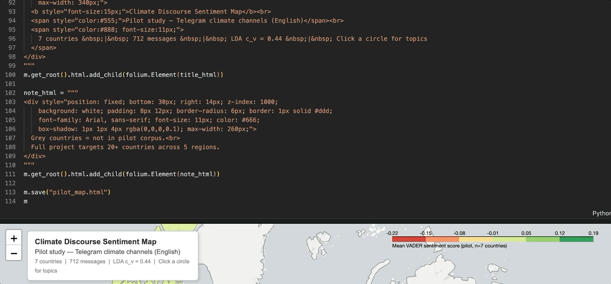

# 🌍 Real-Time Geospatial Analysis of Multilingual Climate Discourse

A research proposal and working pilot study for a real-time NLP pipeline that collects climate-change discourse from public **Telegram channels** and **news APIs**, models topics and sentiment with **LDA** and **VADER**, and visualises the results on an **interactive world map**.

[](https://www.python.org/downloads/)
[](https://jupyter.org/)
[](https://python-visualization.github.io/folium/)
[](#-author)
[](#-pilot-study-results)

## 🗺️ Demo

The pilot prototype maps mean sentiment per country and surfaces the top LDA topics on click.



> 📍 Open [`Project/pilot_map.html`](Project/pilot_map.html) directly in a browser, or run `python Project/pilot_map.py` to regenerate it locally.

## 📋 Table of Contents

- [🗺️ Demo](#️-demo)
- [🎯 Overview](#-overview)
- [✨ Features](#-features)
- [🔬 Research Objectives](#-research-objectives)
- [📦 Data Sources](#-data-sources)
- [🚀 Installation](#-installation)
- [💻 Usage](#-usage)
- [📁 Project Structure](#-project-structure)
- [🏗️ Pipeline Architecture](#️-pipeline-architecture)
- [📊 Pilot Study Results](#-pilot-study-results)
- [🌐 Interactive World Map](#-interactive-world-map)
- [🗓️ Programme & Methodology](#️-programme--methodology)
- [👨‍💻 Author](#-author)
- [🙏 Acknowledgments](#-acknowledgments)
- [🔮 Future Work](#-future-work)
- [📚 References](#-references)

## 🎯 Overview

This repository contains an MSc research project proposal for **Data Mining and Text Analytics** (University of Leeds), together with a runnable pilot implementation that proves the core pipeline works end to end.

Most published climate-discourse NLP research relies on Twitter/X data and English-only text — a static, single-platform, single-language view of a global conversation. This project targets the gap directly: it collects **multilingual** climate discourse from **Telegram**, the dominant civic messaging platform across the GCC, Eastern Europe, and South-East Asia, combines it with mainstream news coverage, and visualises how climate framing and sentiment vary **geographically** — updated from live data rather than a fixed snapshot.

The project demonstrates good practice in:
- **Critical literature evaluation** — three credible existing approaches assessed with quantitative evidence and justified rejection
- **Genuine pilot implementation** — a real, running pipeline on real Telegram data, not just a description of one
- **Reproducible NLP methodology** — LDA topic modelling and VADER sentiment analysis with documented tuning and coherence scoring
- **Transparent research practice** — surprises, errors, and their resolutions are documented rather than smoothed over

## ✨ Features

- 📡 **Telegram data collection** via the Telethon (MTProto) API, with rate-limit-aware retry handling
- 🧹 **Multilingual-aware preprocessing** — emoji-to-text conversion, URL stripping, tokenisation, and a custom domain + platform stopword list
- 🧠 **Relevance filtering** with a Naive Bayes classifier to remove off-topic content that keyword-based channel search lets through
- 🗂️ **LDA topic modelling** (scikit-learn) with **Gensim c_v coherence scoring** to select and validate the topic count
- 💬 **VADER sentiment analysis** producing per-country/per-region sentiment profiles
- 🗺️ **Interactive Folium choropleth map** — click any country to see its mean sentiment and top-5 LDA topics
- 📝 **Fully documented pilot** — every design decision, surprise, and error is logged with cause and resolution (see the [Appendix](Project/Appendix.md))

## 🔬 Research Objectives

**Hypothesis.** A real-time, multi-source NLP pipeline integrating Telegram channel data and news APIs can detect geospatial variation in climate change framing and sentiment more comprehensively than existing single-platform, static, English-only approaches. A corpus of 10,000+ multilingual Telegram messages, processed with LDA and VADER, is expected to reveal statistically significant discourse differences across at least three geographic regions, with mean topic coherence (c_v) ≥ 0.50.

**Measurable objectives:**

| # | Objective | Target | By |
|---|-----------|--------|-----|
| 1 | Collect a multilingual Telegram corpus | ≥ 10,000 messages, 20+ channels, 5+ regions | Month 2 |
| 2 | Tune LDA topic modelling | Mean coherence (c_v) ≥ 0.50 | Month 3 |
| 3 | Apply VADER sentiment analysis | Significant variation across ≥ 3 regions | Month 4 |
| 4 | Build an interactive world map dashboard | Live country-level topic + sentiment view | Month 4 |
| 5 | Evaluate with domain experts | SUS score ≥ 70, ≥ 10 evaluators | Month 5 |

## 📦 Data Sources

**Pilot corpus (completed):**
- 10 public, English-language, climate-focused Telegram channels
- 1,000 raw messages → **712 unique user-authored messages** after deduplication and bot-post removal
- **498 messages** after Naive Bayes relevance filtering (30.1% flagged off-topic)
- 6–7 countries with derivable geographic origin: United Kingdom, United States, Australia, Germany, Canada, India (plus an illustrative UAE entry in the notebook demo)

**Full-project corpus (planned):**
- ≥ 10,000 messages from 20+ Telegram channels across 5 regions (GCC, Europe, North America, South-East Asia, Sub-Saharan Africa)
- Supplemented with news coverage from [GDELT](https://www.gdeltproject.org/) and NewsAPI
- Non-English content (Arabic, Russian, Persian) machine-translated via Helsinki-NLP MarianMT, validated against ArSenL (Arabic) and BLEU-score thresholds

## 🚀 Installation

### Prerequisites

- Python 3.11 or higher
- Jupyter Notebook / JupyterLab
- A registered [Telegram API application](https://my.telegram.org) (only required to re-collect live data — the pilot notebook runs on an illustrative sample without one)

### Setup

1. **Clone the repository**
```bash
git clone https://github.com/SalemAlnaqbi/Real-Time-Geospatial-Analysis-of-Multilingual-Climate-Discourse-Across-Telegram-and-News-Media.git
cd Real-Time-Geospatial-Analysis-of-Multilingual-Climate-Discourse-Across-Telegram-and-News-Media
```

2. **Create a virtual environment** (recommended)
```bash
python -m venv venv
source venv/bin/activate  # On Windows: venv\Scripts\activate
```

3. **Install dependencies**
```bash
pip install nltk scikit-learn gensim emoji vaderSentiment folium telethon jupyter
```

4. **Download NLTK resources** (one-time)
```python
import nltk
nltk.download('punkt')
nltk.download('stopwords')
```

## 💻 Usage

### 1. Run the full proposal + pilot notebook

The notebook combines the written proposal with the runnable pilot pipeline (preprocessing, relevance filtering, LDA + coherence scoring, VADER sentiment analysis, and the interactive map).

```bash
jupyter notebook "Project/Research_Proposal_and_Pilot_Study.ipynb"
```

The processing cells run on a small illustrative sample of synthetic Telegram-style messages so the notebook is self-contained and does not redistribute scraped channel content. Data-collection cells that require live API credentials are shown as reference code rather than executed.

### 2. Regenerate the standalone pilot map

```bash
python Project/pilot_map.py
```

**Output:** `Project/pilot_map.html` — opens automatically in your browser. Reproduces the Folium choropleth map using the sentiment scores and LDA topics reported in the Pilot Study section.

### 3. Collect live Telegram data (optional, requires API credentials)

```python
from telethon.sync import TelegramClient

api_id = 'YOUR_API_ID'
api_hash = 'YOUR_API_HASH'
channels = ['climateactionuk', 'greenplanetofficial', 'climatecrisischannel']

with TelegramClient('session', api_id, api_hash) as client:
    for channel in channels:
        for msg in client.get_messages(channel, limit=100):
            if msg.text:
                print(msg.date, msg.text)
```

## 📁 Project Structure

```
Real-Time-Geospatial-Analysis-of-Multilingual-Climate-Discourse/
├── Project/
│   ├── Research_Proposal_and_Pilot_Study.ipynb   # Main notebook: proposal + runnable pilot pipeline
│   ├── Research_Proposal.md                      # Full written proposal (Markdown)
│   ├── Research_Proposal_Final.docx              # Formatted submission copy
│   ├── Appendix.md                                # Tool-use documentation + error analysis
│   ├── Appendix.docx
│   ├── pilot_map.py                               # Standalone script — regenerates the Folium map
│   ├── pilot_map.html                             # Generated interactive map output
│   ├── OCOM5204M_Project_Requirements.md          # Assessment requirements reference
│   ├── CLAUDE.md                                  # Project/writing-style guide for AI-assisted drafting
│   ├── Approaches/                                # Reference papers for the critical analysis
│   ├── New_Approach/                              # Earlier drafts and candidate topics
│   └── ...
├── Final_A2/
│   └── OCOM5204M_A2_Project_Proposal_*.{docx,pdf} # Final submitted assessment
└── README.md
```

## 🏗️ Pipeline Architecture

```
Telegram Channels ──┐
                     ├──► Collection (Telethon) ──► Deduplication / Bot Filtering
News APIs (GDELT) ───┘                                        │
                                                                ▼
                                    Preprocessing (lowercase, URL strip,
                                    emoji→text, tokenisation, stopword removal)
                                                                │
                                                                ▼
                                   Relevance Filtering (Naive Bayes, TF-IDF)
                                                                │
                              ┌─────────────────────────────────┴─────────────────────────────────┐
                              ▼                                                                     ▼
              LDA Topic Modelling (scikit-learn)                                  VADER Sentiment Analysis
              + Gensim c_v Coherence Scoring                                      (per-message compound score)
                              │                                                                     │
                              └─────────────────────────────────┬─────────────────────────────────┘
                                                                ▼
                                        Per-Country Aggregation (topics + sentiment)
                                                                │
                                                                ▼
                                      Interactive Folium Choropleth World Map
```

**Key design decisions:**
- **LDA over neural topic models (e.g. BERTopic):** CPU-only, deterministic given a fixed seed, and already achieves interpretable topics at pilot scale — no GPU dependency for a real-time pipeline
- **VADER over multilingual transformers (e.g. XLM-RoBERTa):** rule-based, no fine-tuning corpus required, and fast enough for high-throughput streaming text
- **Two-stage emoji handling:** emoji must be converted to text *before* tokenisation (or the tokeniser shreds them into byte fragments), and the resulting descriptions must then be filtered (or they pollute topic keywords) — see [Error 2](Project/Appendix.md#error-2-emojidemojize-converting-emoji-to-descriptions-that-then-appeared-as-lda-topic-words)

## 📊 Pilot Study Results

| Metric | Value |
|--------|-------|
| **Channels collected** | 10 |
| **Raw messages** | 1,000 |
| **After deduplication / bot filtering** | 712 |
| **After Naive Bayes relevance filtering** | 498 (30.1% removed) |
| **Relevance classifier F1 (5-fold CV)** | 0.79 |
| **LDA topics (final)** | 5 |
| **Topic coherence (c_v), initial run** | 0.38 |
| **Topic coherence (c_v), tuned** | 0.44 |
| **Target coherence (Objective 2)** | ≥ 0.50 |

**Interpretable topics found:** renewable energy policy, extreme weather events, climate activism/protests, corporate emissions reporting, COP negotiation coverage.

**Geographic sentiment variation (VADER, mean compound score):**

| Country | Mean Sentiment | Polarity |
|---------|----------------|----------|
| Australia | −0.22 | Negative (extreme weather focus) |
| United States | −0.14 | Negative |
| India | −0.09 | Negative |
| United Kingdom | −0.07 | Negative |
| Canada | +0.05 | Slightly positive |
| Germany | +0.11 | Positive (renewable energy focus) |

**Two genuine surprises from the pilot:**
1. **Emoji saturation broke the standard NLTK tokeniser** — Telegram's far higher emoji density (vs. Twitter) fragmented emoji into 300+ non-semantic tokens until an emoji-to-text conversion step was added.
2. **~30% of messages from climate-named channels were off-topic** — channel names/descriptions do not reliably predict content, requiring a dedicated Naive Bayes relevance-filtering stage not needed in any of the three reviewed baseline approaches.

Full methodology, tuning steps, and reasoning are documented in [`Research_Proposal.md`](Project/Research_Proposal.md#5-pilot-study) and the [`Appendix`](Project/Appendix.md).

## 🌐 Interactive World Map

The Folium-based prototype dashboard renders a country-level choropleth of climate sentiment with click-through topic detail.

### Features

- 🎨 **Choropleth layer** — countries coloured on a red-to-green scale by mean VADER sentiment
- 📍 **Click-through markers** — reveal the top 5 LDA topic keywords and sentiment score per country
- 🏷️ **Legend + summary panel** — corpus size, channel count, and coherence score at a glance
- 🖥️ **Standalone HTML export** — runs in any browser with no server required

### Example usage

```bash
python Project/pilot_map.py
# → Map saved to: Project/pilot_map.html (opens automatically)
```

The full-project version (Phase 4, Month 4) extends this to 10,000+ messages, 20+ regions, and a temporal slider for month-by-month filtering — see [Programme & Methodology](#️-programme--methodology).

## 🗓️ Programme & Methodology

The full 6-month project follows **CRISP-DM**, chosen because its iterative Data Understanding ↔ Preparation ↔ Modelling loop matches the tuning cycle the pilot already required for LDA, and its Deployment phase accommodates the dashboard as a working system rather than a static research artefact.

| Phase | Focus | Timeline | Milestone |
|-------|-------|----------|-----------|
| 1. Data Acquisition | Channel selection, Telegram + GDELT/NewsAPI collection | Months 1–2 | Corpus ≥ 10,000 messages |
| 2. Data Preparation | Translation (MarianMT), relevance filtering, spaCy NER | Months 2–3 | Preprocessed corpus ready |
| 3. Modelling | LDA tuning + coherence, VADER + validation | Months 3–4 | Coherence ≥ 0.50 |
| 4. Dashboard | Folium map, temporal slider, packaging | Month 4 | Prototype complete |
| 5. Evaluation | Expert usability + content-validity testing (SUS ≥ 70) | Month 5 | SUS + validity confirmed |
| 6. Reporting | Final report, open-source release, conference draft | Month 6 | Final report submitted |

Full risk analysis (three risks + mitigations per phase) is in [`Research_Proposal.md`](Project/Research_Proposal.md#6-programme-and-methodology).

## 👨‍💻 Author

**Salem Alnaqbi**

- GitHub: [@SalemAlnaqbi](https://github.com/SalemAlnaqbi)
- LinkedIn: [salemalnaqbi](https://www.linkedin.com/in/salemalnaqbi/)
- MSc Artificial Intelligence, University of Leeds — Data Mining and Text Analytics, supervised by Dr Noorhan Abbas

## 🙏 Acknowledgments

- **Supervision:** Dr Noorhan Abbas, University of Leeds — Data Mining and Text Analytics
- **Libraries:** [Telethon](https://github.com/LonamiWebs/Telethon) for Telegram data access, [scikit-learn](https://scikit-learn.org/) and [Gensim](https://radimrehurek.com/gensim/) for topic modelling, [VADER](https://github.com/cjhutto/vaderSentiment) for sentiment analysis, [Folium](https://python-visualization.github.io/folium/) for geospatial visualisation
- **Data:** [GDELT Project](https://www.gdeltproject.org/) for planned news-discourse collection
- **Prior work referenced:** Shiwakoti et al. (2024) ClimaConvo, Otmakhova and Frermann (2025) narrative framing, Song et al. (2025) moral foundations analysis — see [References](#-references)

## 🔮 Future Work

- [ ] Collect the full 10,000+ message multilingual corpus across 20+ Telegram channels and 5 regions
- [ ] Integrate MarianMT translation for Arabic, Russian, and Persian content with BLEU/sentiment-preservation validation
- [ ] Add spaCy multilingual NER for entity extraction and PII anonymisation
- [ ] Extend the dashboard with a temporal slider and live data refresh (Flask backend)
- [ ] Run the SUS + content-validity evaluation with 10+ domain experts
- [ ] Release an anonymised corpus and full codebase under a Creative Commons licence (per Phase 6)

## 📚 References

Blei, D.M., Ng, A.Y. and Jordan, M.I. (2003) 'Latent Dirichlet allocation', *Journal of Machine Learning Research*, 3, pp. 993–1022.

Chapman, P. et al. (2000) *CRISP-DM 1.0: Step-by-step data mining guide*. Chicago: SPSS Inc.

Hutto, C. and Gilbert, E. (2014) 'VADER: A parsimonious rule-based model for sentiment analysis of social media text', in *Proceedings of ICWSM 2014*, Ann Arbor, Michigan, pp. 216–225.

Otmakhova, Y. and Frermann, L. (2025) 'Narrative media framing in political discourse', arXiv:2506.00737 [Preprint].

Shiwakoti, S. et al. (2024) 'Analyzing the dynamics of climate change discourse on Twitter', in *Proceedings of LREC-COLING 2024*, Torino, Italy, pp. 984–994.

Song, Y. et al. (2025) 'Bridging ideologies: analyzing the use of moral language and framing in social media discourse on climate change by U.S. congress members', *Climatic Change*, 178, 56.


---

<div align="center">

**⭐ If you find this project useful, please consider giving it a star!**


</div>
